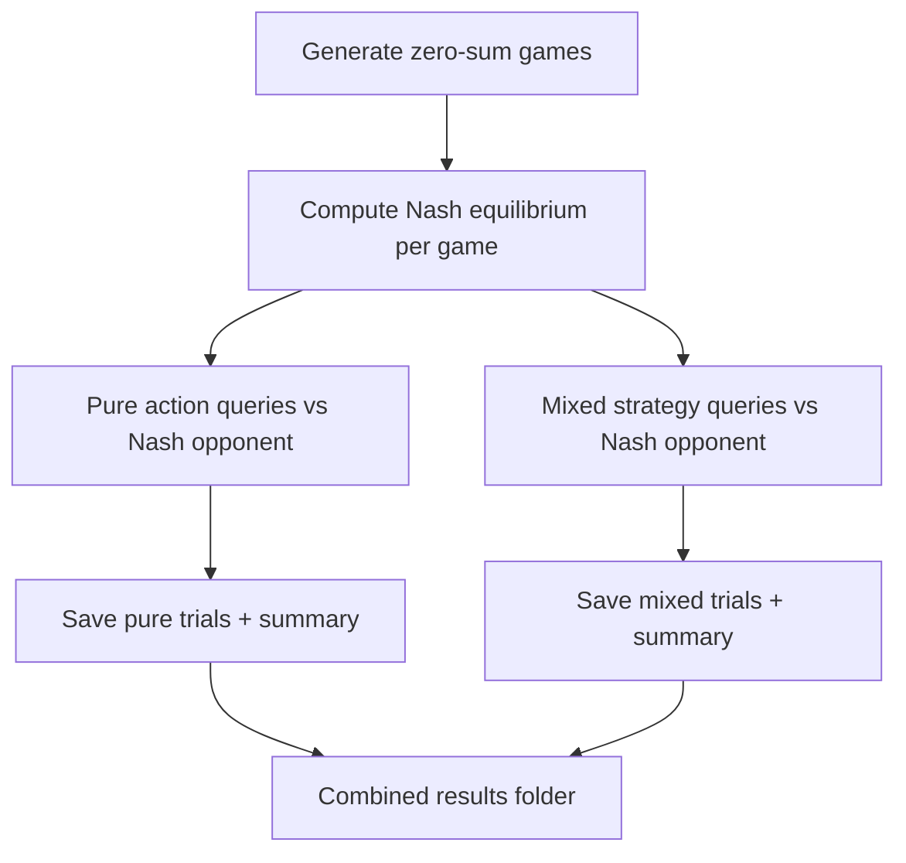

# Benchmark Flow (Current Design)



This document reflects the current benchmark design: we run both pure-action and mixed-strategy queries against a fixed Nash opponent, and we do **not** treat this as a pure-vs-mixed comparison. The current results show that **neither mode reliably solves the games**, and the next step is to fine-tune models to improve game-theoretic play.

---

## 1) Game Generation (Zero-Sum Only)

- Generate $N$ random zero-sum matrix games (default: 3x3).
- Payoff matrix $U[i,j]$ is the row player's payoff.
- Column player's payoff is $-U[i,j]$ (zero-sum constraint).
- Payoffs are sampled from a fixed range (default: $[-100, 100]$).

---

## 2) Nash Equilibrium Setup (One-Time per Game)

For each game, compute the Nash equilibrium mixed strategies:

- Row player strategy $\sigma_r$
- Column player strategy $\sigma_c$
- Nash value $v^* = \sigma_r^T U \sigma_c$

**Key constraint used in all trials:** the column player **always** plays $\sigma_c$.

---

## 3) Two Query Modes (Same Games, Same Opponent)

We run two modes on the **same games** to measure how far the LLM is from optimal play in either interface:

### A) Pure Action Mode
- LLM chooses a single action $a \in \{0,1,2\}$.
- LLM value:
  $$V_{\text{llm}} = U[a,:] \cdot \sigma_c$$
- Best response value:
  $$V_{\text{br}} = \max_i U[i,:] \cdot \sigma_c$$
- Nash gap:
  $$\text{gap} = V_{\text{br}} - V_{\text{llm}}$$

### B) Mixed Strategy Mode
- LLM outputs a probability distribution $\sigma_{\text{llm}}$.
- LLM value:
  $$V_{\text{llm}} = \sigma_{\text{llm}}^T U \sigma_c$$
- Nash gap:
  $$\text{gap} = v^* - V_{\text{llm}}$$

**Important:** We are **not** comparing pure vs mixed as a winner. Both are evaluated as interfaces for the same strategic task, and the current evidence is that **neither achieves near-optimal play reliably**.

---

## 4) Prompts Given to the LLM

Both prompts explicitly tell the LLM that the opponent plays the Nash mixed strategy.

### Pure Action Prompt (Excerpt)

```text
Zero-sum matrix game:
Your payoff matrix (you are the row player):

  Col0      Col1      Col2
Row0    ...       ...       ...
Row1    ...       ...       ...
Row2    ...       ...       ...

Your actions: Row0, Row1, Row2
Opponent has 3 possible actions

IMPORTANT: The opponent is playing their Nash equilibrium mixed strategy.
What single action do you choose? Respond with just the action number (0, 1, or 2).
```

### Mixed Strategy Prompt (Excerpt)

```text
Zero-sum matrix game:
Your payoff matrix (you are the row player):

  Col0      Col1      Col2
Row0    ...       ...       ...
Row1    ...       ...       ...
Row2    ...       ...       ...

Your actions: Row0, Row1, Row2
Opponent has 3 possible actions

IMPORTANT: The opponent is playing their Nash equilibrium mixed strategy.
Provide YOUR mixed strategy (probability distribution) as a JSON object.
The probabilities must sum to 1.0 and be non-negative.

Example response format:
{"action_0": 0.5, "action_1": 0.3, "action_2": 0.2}

Respond ONLY with valid JSON, no other text.
```

---

## 5) Output Structure (Combined Runs)

By default, combined runs write to a timestamped folder:

```
results/pure_and_mixed_YYYYMMDD_HHMMSS/
```

If you pass `--overwrite`, the combined run overwrites a fixed folder:

```
results/pure_and_mixed_latest/
├── games.json
├── trials_pure_actions.json
├── summary_pure_actions.json
├── trials_mixed_strategy.json
└── summary_mixed_strategy.json
```

- `games.json` stores the payoff matrices and Nash equilibria.
- Trial files store per-game decisions and gap values.
- Summary files store aggregate statistics (mean, median, etc.).

---

## 6) Worked Example (2x2 Game)

Suppose the payoff matrix is:

$$
U = \begin{bmatrix}
2 & -1 \\
-3 & 1
\end{bmatrix}
$$

Assume the Nash column strategy is $\sigma_c = [0.75, 0.25]$.

### Pure Action Example

- LLM chooses action 0.
- LLM value:
  $$V_{\text{llm}} = U[0,:] \cdot \sigma_c = 2(0.75) + (-1)(0.25) = 1.25$$
- Best response value:
  $$V_{\text{br}} = \max_i U[i,:] \cdot \sigma_c = \max(1.25, -2.0) = 1.25$$
- Nash gap:
  $$\text{gap} = 1.25 - 1.25 = 0$$

### Mixed Strategy Example

- LLM outputs $\sigma_{\text{llm}} = [0.6, 0.4]$.
- LLM value:
  $$V_{\text{llm}} = \sigma_{\text{llm}}^T U \sigma_c = 0.6(1.25) + 0.4(-2.0) = -0.1$$
- If the Nash value is $v^* = 0.5$, then:
  $$\text{gap} = 0.5 - (-0.1) = 0.6$$

---

## 7) What This Benchmark Shows (Current Conclusion)

- The LLM is measured against a **fixed Nash opponent**.
- The Nash gap quantifies how far the LLM is from optimal play.
- In current runs, **both pure-action and mixed-strategy outputs are far from solving the games**.

This is intentional: the benchmark highlights **strategic gaps**. The next phase is to **fine-tune** models on game-theoretic data so they can approach Nash-quality play.

---

## 8) Next Step: Fine-Tuning Plan (High-Level)

1. Use `games.json` + trial data to build supervised targets.
2. Fine-tune Llama 3.1 on correct responses (pure best response or Nash-like mixed outputs).
3. Re-run the benchmark to measure reduced Nash gaps.

---

## Summary

- All games are zero-sum.
- Opponent always plays Nash.
- We evaluate two interfaces (pure and mixed) but **do not frame it as a contest**.
- The current takeaway: **neither interface solves the games yet**.
- The goal is to **fine-tune** and then re-measure improvements.
